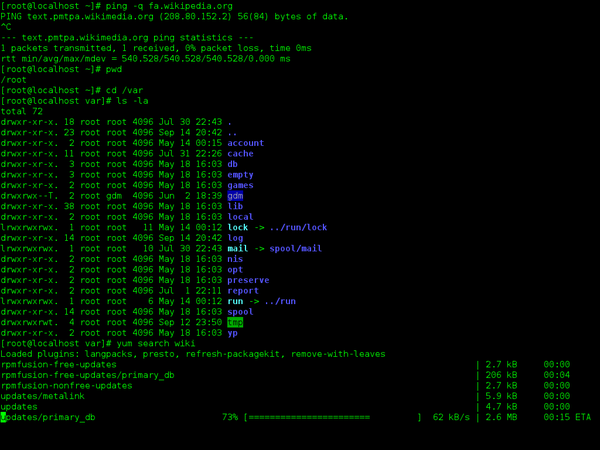
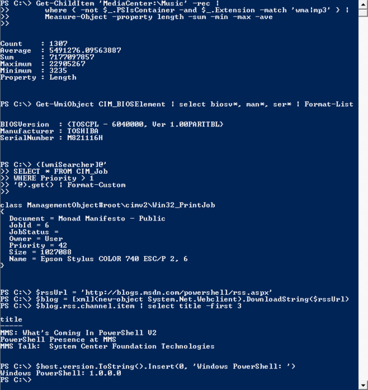
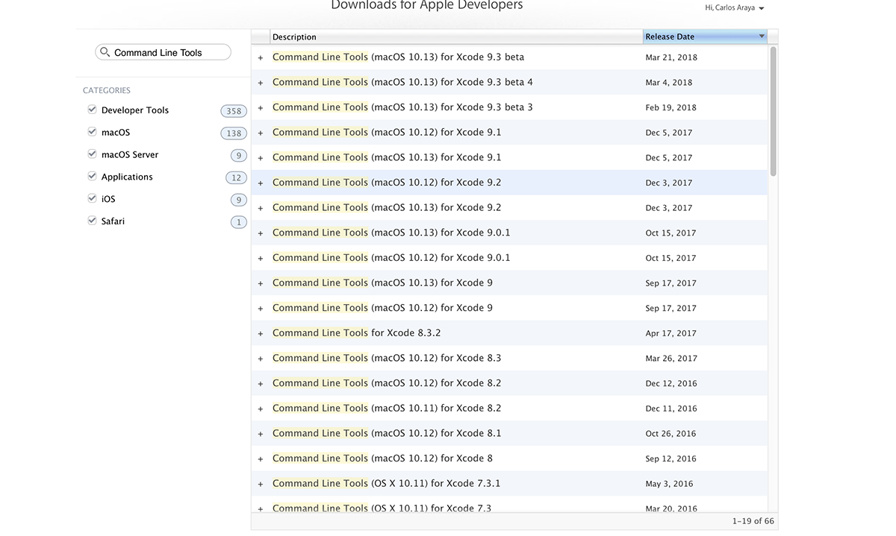
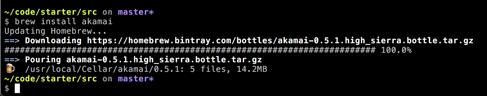
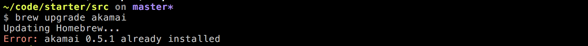
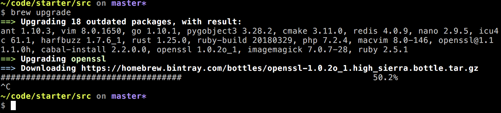
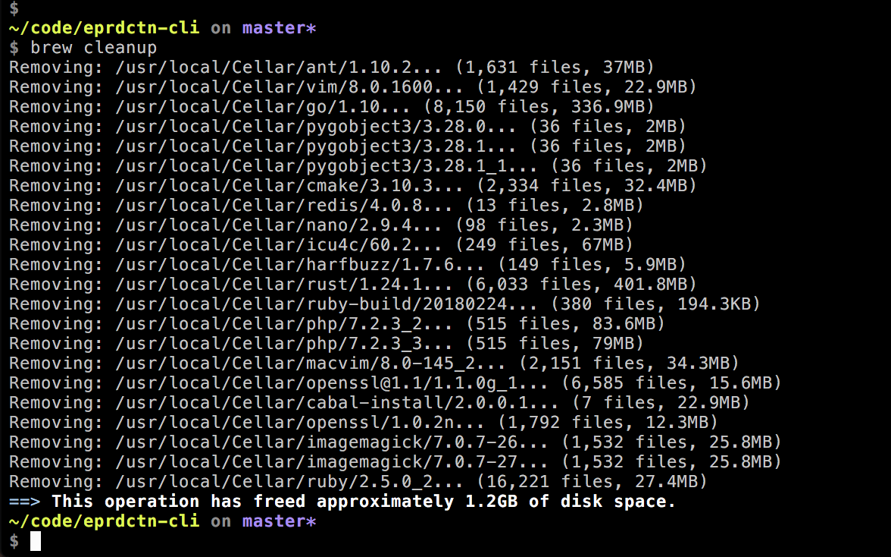

# EPRDCTN in the command line

* [Introduction](#introduction)
  * What is the command line?
  * Why should we care?
  * What command line tools will we use?
    * PowerShell
    * Windows Subsystem for Linux (WSL) on Widows
      * Ubuntu Linux Image
  * [Terminal](#better-terminal)
    * iTerm 2 on MacOS
    * default Bash shell on WSL
  * Before we get started
    * Mac Users: Install XCode
    * Windows Users: Make sure WSL and the Ubuntu Image are installed
* [Package managers](#package-managers)
   * Homebrew (Macintosh)
     * Installing Ruby on WSL / Using the system Ruby on Mac
     * Brew and Cask
   * apt-get (WSL)
* [Node.js](#node)
  * Download and Install
  * NVM
  * Package.json: The core of a Node Project
* [JREs](#java)
  * Our old friend, Java
  * Differences between JDK and JRE
    * Do I need Both?
  * Installation
* [Got Git?](#git)
  * What it is?
  * H0w does it work?
* [Basic shell concepts/commands](#shell-basics)
  * globbing
  * piping
  * the path
    * What it is?
    * Why is it important?
    * Mix and Match Windows and Linux Paths through WSL
  * Making the shell remember the way you like things
    * Setting your Path on MacOS and making it stick
* [WSL interoperability with Windows](#wsl-interop)

<a name="introduction" id="introduction"></a>

# Introduction

This series of posts intends to walk you through some basic concepts, activities and shell commands to take the fear and pain away from working with a text-based interface that links directly to the Operating System.

In more formal terms:

> A command-line interface is a means of interacting with a computer program where the user (or client) issues commands to the program in the form of successive lines of text (command lines). A program which handles the interface is called a command language interpreter or shell.
>
> [Wikipedia](https://en.wikipedia.org/wiki/Command-line_interface)

So what does it mean?

It's like an old style terminal where you enter commands that make the computer do something.

All Operating Systems have a CLI. Yes, even Windows and MacOS.

<figure>
  
  <figcaption>Screenshot of a Bash shell in the GNOME windows manager for Linux</figcaption>
</figure>

<figure>
  
  <figcaption>Screenshot of Windows Powershell as it works in Windows Vista</figcaption>
</figure>

This is important because sooner or later you will find tools that will only work from a command line interface. We'll explore some of these tools (Node, Daisy Ace) in later sections but it's important make this clear.

## What command line tools will we use? What tools will we not use?

In Windows the better tools are [PowerShell](https://docs.microsoft.com/en-us/powershell/scripting/powershell-scripting?view=powershell-6) a souped up terminal shell with additional scripting capabilities, and [Windows Subsystem for Linux (WSL)](https://docs.microsoft.com/en-us/windows/wsl/about) a way to run Linux native applications from Windows. It uses a Ubuntu Linux image for Windows, not a modified version of Linux to run on Windows but a full version of Ubuntu Linux that will work together with Windows.

As far as terminals are concerned we'll use the [iTerm2](https://www.iterm2.com/) for the Mac and a standard Bash shell for WSL.

## Before we get started

Before we jump into further installations and customizations we need to do a few things that are dependent on the Operating System we're using.

### Mac Users: Install XCode

Before we install Homebrew we need to install Xcode command line tools. These are part of the full Xcode download but I'd rather save you the 5GB+ download so we'll go the slim (but with more steps) route instead.

1. Go to the [Apple Developer's site](https://developer.apple.com/)
2. Click on the account link on the right side of the top navigation bar. You can use the same account that you use of iTunes or any Apple property.
   * If prompted verify your account. This mostly happens when logging in from a new location or with a new computer
3. Click on Download Tools
4. Scroll down the screen and click on **See more downloads**
5. On the search box (to the left of the list of items to download) enter **Command Line Tools**. This will reduce the number of entries
6. Download the version that matches your MacOS version
7. Install the package.

The version I downloaded was 173MB. I'm OK with the extra work :)

<figure>
  
  <figcaption>Command Line Tools For Xcode download screen</figcaption>
</figure>

### Windows Users: Make sure WSL and the Ubuntu Image are installed

Before we move forward with WSL and Linux on Windows we need to make sure we have the right version of WSL installed and that we downloaded Ubuntu from the Microsoft Store.

These instructions assume you're using the latest veersion of Windows.

1. Install the latest version of PowerShell
   * Download the MSI package from our GitHub releases page. The MSI file looks like this - PowerShell-6.0.0.`<buildversion>.<os-arch>`.msi
   * Once downloaded, double-click the installer and follow the prompts. There is a shortcut placed in the Start Menu upon installation.
   * By default the package is installed to `$env:ProgramFiles\PowerShell\`
   * You can launch PowerShell via the Start Menu or `$env:ProgramFiles\PowerShell\pwsh.exe`
1. Install WSL from PowerShell as Administrator
   * Type powershell in the Cortana search box
   * Right click on Windows PowerShell on the results and select Run as administrator
   * The UAC prompt will ask you for your consent. Click Yes, and the elevated PowerShell prompt will open
1. In the PowerShell window you just opened type: `Enable-WindowsOptionalFeature -Online -FeatureName Microsoft-Windows-Subsystem-Linux`
   * Reboot the system when prompted
1. Install your Linux Distribution
   * Open the Microsoft Store and choose your distribution. We'll be working with Ubuntu; other distributions are presented for reference.
   * [Ubuntu](https://www.microsoft.com/store/p/ubuntu/9nblggh4msv6)
   * [OpenSUSE](https://www.microsoft.com/store/apps/9njvjts82tjx)
   * [SLES](https://www.microsoft.com/store/apps/9p32mwbh6cns)
   * [Kali Linux](https://www.microsoft.com/store/apps/9PKR34TNCV07)
   * [Debian GNU/Linux](https://www.microsoft.com/store/apps/9MSVKQC78PK6)
1. Select "Get"
1. Once the download has completed, select "Launch".
   * This will open a console window. Wait for installation to complete then you will be prompted to create your LINUX user account
1. Create your LINUX username and password. This user account has **_no relationship_** to your Windows username and password and hence can be different


<a name="better-terminal" id="better-terminal"></a>

## Installing a terminal on the Mac

Even though there is a terminal bundled with MacOS (hidden inside applications -> utilities) I like [iTerm 2](https://www.iterm2.com/) as a more feature complete replacement for the terminal that comes with MacOS. You can download it from the iTerm 2 [download site](https://www.iterm2.com/downloads.html) and, please, make sure you download the stable release.

<a name="package-managers" id="package-managers"></a>

## Package Managers

Most Operating systems have ways to automate software installation, upgrade, management and configuration of the software on your computer with package managers.

Package managers are designed to eliminate the need for manual installs and updates. This can be particularly useful for Linux and other Unix-like systems, typically consisting of hundreds or even tens of thousands of distinct software packages.[2]

We'll look at [Homebrew](https://brew.sh/) and [apt-get](https://itsfoss.com/apt-get-linux-guide/), their requirements and ecosystems, along with some basic commands to get you started.

<a name="homebrew" id="homebrew"></a>

### Homebrew and Cask

Homebrew allows you access to a large ecosystem of Unix Software on your Mac. It is a [Ruby](https://www.ruby-lang.org/en/) application which is one of the reasons why we installed the Xcode command line tools; they include Ruby.

To install Homebrew paste the following command on your terminal. This will download, install and configure Homebrew.

```bash
/usr/bin/ruby -e "$(curl -fsSL https://raw.githubusercontent.com/Homebrew/install/master/install)"
```

Now that we have installed Homebrew we'll use it to install, upgrade and remove (uninstall) a package. Even though I've chosen to install a single package. The same would be applicable to single package and multiple package installs.

This and the following sections will install the `akamai` package.

#### Installing the package

Installing packages is simple. The command is:

```bash
brew install akamai
```

The command will also install any dependencies needed for the package to run. Akamai has no dependencies.

<figure>
  
  <figcaption>Screenshot showing the install process for a homebrew package</figcaption>
</figure>

#### Updating/Upgrading the package

We should periodically update our packages to make sure we're using the latest version and capture any/all packages. The upgrade process gives us two options, one is to upgrade individual packages with an example like the one below:

```bash
brew upgrade akamai
```

If the package you're upgrading individually is already up to date, Homebrew will present you with this 'error' message. It's not an error at all, just Homebrew's way of telling you it's not needed.

<figure>
  
  <figcaption>alt-text</figcaption>
</figure>

The other option is to upgrade all installed packages at the same time by just using

```bash
brew upgrade
```

<figure>
  
  <figcaption>Homebrew upgrade process for all packages</figcaption>
</figure>

#### Uninstalling the package

When we're done, we can uninstall the package to free up space in the hard drive (always a concern for me). The command is

```bash
brew uninstall akamai
```

#### Cleaning up after your installed packages

OK, I'll admit it... I have packages in my Homebrew installation that I haven't used in ages but, sooner or later my hard drive will complain and force me to cleanup old stuff. With homebrew this is simple, the command is:

```bash
brew cleanup
```

This will go through all installed packages and remove old versions. It will also report when it skips versions because the latest one is not installed and how much hard drive space it gave you back

<figure>
  
  <figcaption>Homebrew cleanup showing a listing of removed packages and how much disk space was saved in the process.</figcaption>
</figure>

There are more commands to use when troubleshooting and building recipes for Homebrew but the ones we've covered are the basic ones you'll use most often.

#### Cask: Like Homebrew but for applications

I don't particularly care for the way you have to install some software for MacOS. You download the file, open it then drag the application to the applications folder in your Mac (usually aliased in the folder created by the installer) and only then you can actually use the program.

The creators of Homebrew put out Cask, a command line software installer. The installation is simple, paste the following command on your terminal:

```bash
brew tap caskroom/cask
```

Then you can use Cask to install software on your system. For example, to install Java, run the following command.

```bash
cask install java
```

<a name='apt-get' id='apt-get'></a>

### Apt-get and apt-cache for Windows (?)

Linux is built around the concept of packages. Everything in a Linux distribution from the kernel, the core of the Operating System, and every application is built as a package. Ubuntu uses APT as the package manager for the distribution.

There are two commands under the `apt-get` umbrella: apt-get itself and apt-cache. apt-get is for installing, upgrading and cleaning packages while apt-cache is used for finding new packages. We'll look at the basic uses for both these commands in the next sections.

#### Update package database with apt-get

apt-get works on a database of available packages. You must update the database before updating the system, otherwise apt-get won’t know if there are newer packages available. This is the first command you need to run in any Linux system after a fresh install.

Updating the package database requires super user privileges so you’ll need to use sudo.

```bash
sudo apt-get update
```

#### Upgrade installed packages with apt-get

Once you have updated the package database, you can upgrade the installed packages. Using `apt-get upgrade` will update all packages in the system for which an update is available. There is a way to work with individual packages that we'll discuss when installing new packages

```bash
# Upgrades all packages for which an update is available
sudo apt-get upgrade
```

You can also combine the update and upgrade command into a single command that looks like this:

```bash
# Combines both update and upgrade command
sudo apt-get update && sudo apt-get upgrade -y
```

The logical and will make sure that both commands run and will fail if either do. It is the same as running the commands individually.

#### Installing individual packages

After you update your system there is not much need to update it again. However you may want to install new packages or update individual packages. The `install` command will do either.

```bash
sudo apt-get install ack
```

If the package is not installed, the command will install it, along with its dependencies and make the command available to you.

If you've already installed the package, either during an upgrade or manual install, the command will compare the installed version with the one you want to install, if the existing version is the same or newer the installer will skip and exit. If the version being installed is newer then the installer will execute the upgrade.

#### Uninstalling individual packages

There are a few times when a package breaks stuff somewhere else or you no longer need the functionality the package provides. In this case you can do two things.

You can use the `remove` command to only remove the binaries, the applications themselves, and leave configuration and other auxiliary files in place. This will make it asier to keep your configuration without having to write it down.

```bash
# ONLY REMOVES BINARIES
sudo apt-get remove ack
```

The next, and more extreme, option is to use the `purge` command. This will get rid of all portions of the package, beyond what the `remove` command will do. Use sparingly if at all.

```bash
# REMOVES EVERYTHING, INCLUDING CONFIGURATION FILES
sudo apt-get purge ack
```

#### Cleaning up after yourself

Just like with Homebrew, apt-get will keep older versions of installed packages. Sooner or later your system will complain about being low on resources and will require you to clean up the system

The first option is to run the `clean` command. This will clean your local system of all downloaded package files.

```bash
sudo apt-get clean
```

The second options is the less extreme `autoclean` command. This will only removes those retrieved package files that have a newer version now and they won’t be used anymore.

```bash
sudo apt-get autoclean
```

#### apt-search to find packages

There are times when you're looking for someting but are not sure exactly what. This is where the `apt-cache search` command comes in, if you enter a search term it'll find all related packages.

```bash
apt-cache search <search term>
```

If you know the exact package name you can use `apt-cache pkgnames` command that will return all package names that match your search criteria. The number of returned items will be smaller than the search return.

```bash
apt-cache pkgnames <search_term>
```

<a name="node" id="node"></a>

## Node

[Node.js](https://nodejs.org/en/) (or just Node) is a cross platform Javascript interpreter built on the [V8](https://developers.google.com/v8/), the same Javascript interpreter that powers Google Chrome.  Initially Node was created to run Javascript on the server but it has also been used to create a lot of tools for use on personal computers. This is the side of Node that we'll concentrate in. 

In this section we'll look at the following aspects of Node:

* Installing Node with NVM
  * Why I chose this method
* Installing, removing and updating packages
  * Global install
* Some examples of what you can do with Node

### Installing Node with NVM

[NVM](https://github.com/creationix/nvm) is a set of shell scripts that allow you to download, configure and use multiple versions of Node without conflict. It installs and configure the Node binaries to run from your home directory, avoding potential permission issues. 

To install NVM open your terminal (or WLS though PowerShell) and paste the following command:

```bash
curl -o- https://raw.githubusercontent.com/creationix/nvm/v0.33.8/install.sh | bash
```

This will download NVM, configure your directory and set permissions appropriately. 

The next step is to actually install Node.  We'll install a LTS (Long Term Support Version) 8. I'm installing a LTS version to make sure we have the best chance of our packages being supported. The latest versionn (9.x) may have changes that will not work with our software. 

To install the latest release of Node 8.x run the following command:

```bash
nvm install 8
```

This will install the latest version that matches the major number you chose to install. As of this writing the latest version is `8.11.1`.  To activate the version you just installed type:

```bash
# Replace 8.11.1 with the version you installed
nvm alias default 8.11.1
# Use the default version you just configured
nvm use default
```


<a name="java" id="java"></a>

## Java: JRE vs JDK, oh my!

<a name="shell-basics" id="shell-basics"></a>

## Basic shell commands, pipes, globes and others

<a name="wsl-interop" id="wsl-interop"></a>
## WSL Interoperability

## Links and Resources

* WSL
  * [WSL Documentation]()
  * [WSL interoperability with Windows]()
* Homebrew
  * [Homebrew Website](https://brew.sh/)
* APT-GET Guide
  * [Using apt-get Commands In Linux](https://itsfoss.com/apt-get-linux-guide/)
* Lynda.com Courses
  * [Workflow Tools for Web Developers](https://www.lynda.com/Web-Design-tutorials/Workflow-Tools-Web-Development/533305-2.html)
  * [Unix for MacOS X Users](https://www.lynda.com/Mac-OS-X-10-6-tutorials/Unix-for-Mac-OS-X-Users/78546-2.html)
